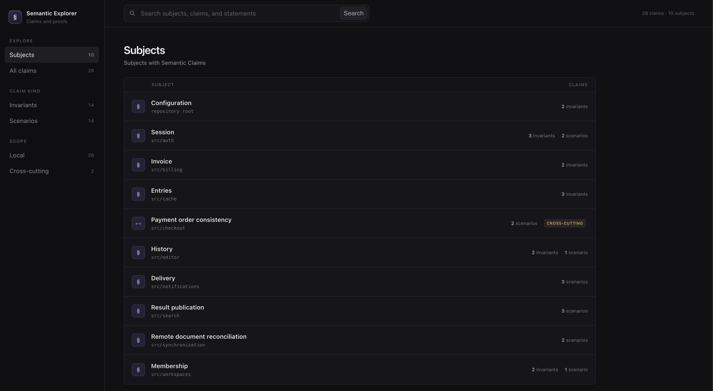

# Semantic Claims Model

With the Semantic Claims Model, important software behavior remains understandable and testable as code changes.

It's for anyone (people, coding agents, sentient animals) who build, maintain, extend, or need to understand software. Its influences include TDD, invariants in code design, and Gherkin-style acceptance criteria.

## The model

The model has three parts:

```text
claim -> proof -> implementation
```

- A **claim** is a plain-language statement of a subject's observable behavior
- A **proof** is a separate executable test of that behavior
- The **implementation** is the code that must satisfy the claim and pass the proof

Each claim has a coherent [**subject**](./SUBJECTS.md) and specifies one part of that subject's semantics as **observable behavior**. Every claim must have at least one **executable proof**.

There are two kinds of claims:

- An **invariant** describes a standing truth.
- A **scenario** describes behavior whose meaning depends on event order.

The sequence is claim, proof, then implementation, forming a discrete unit of context, unambiguous intent, and implementation.

Claim documents get colocated with code and tests. A `--name` claim document is a cross-cutting claim, used when behavior belongs to an interaction among several subjects. Cross-cutting claims apply only to behavior that can't be stated about any single subject, and they don't repeat local claims. They get placed at the closest shared boundary, as they cut across multiple subjects.

Projects can choose file and test conventions that fit their language and test framework. This repository includes [JavaScript and TypeScript conventions](./JAVASCRIPT.md) and a checker for them.

## A small example

Suppose a newer search must take precedence over an older search still in progress. In `search.scenarios.md`, that behavior appears as:

```md
## §1 Search precedence

### §1.1 Newer searches supersede older results

After a newer search begins, completing an older search leaves the latest result unchanged.
```

The claim does not mention an API, library, or implementation. It only describes the observable behavior of published search results.

Under the JavaScript and TypeScript conventions, the paired proof in `search.scenarios.test.ts` repeats the section and claim titles exactly:

```ts
describe('§1 Search precedence', () => {
  it('§1.1 Newer searches supersede older results', () => {
    const older = searches.start();
    const newer = searches.start();

    older.resolve('older');
    expect(searches.latest()).not.toBe('older');

    newer.resolve('newer');
    expect(searches.latest()).toBe('newer');
  });
});
```

The Markdown file contains the claim, and the test proves it by exercising the subject. In JavaScript and TypeScript projects, shared identifiers and matching titles connect each claim to its proof so the checker can detect mismatches.

_Observable_ matters for two reasons:

1. Claims describe what a user, caller, or other subject can observe, not private implementation details.
2. Proofs test that behavior through an observable interface rather than inspecting private mechanisms.

An API and implementation may change while the same observable behavior remains.

## Learn the method

1. [OVERVIEW.md](./OVERVIEW.md): motivation and repo guide.
2. [FAQ.md](./FAQ.md): common questions about Semantic Claims, TDD, and acceptance criteria.
3. [SEMANTICS.md](./SEMANTICS.md): the shared method.
4. [SUBJECTS.md](./SUBJECTS.md): what claims are about.
5. [INVARIANTS.md](./INVARIANTS.md): standing claims.
6. [SCENARIOS.md](./SCENARIOS.md): ordered claims.
7. [EXAMPLES.md](./EXAMPLES.md): claim-decision examples and borderline cases.
8. [EXISTING-SYSTEMS.md](./EXISTING-SYSTEMS.md): incremental adoption without inferring claims from implementation.
9. [JAVASCRIPT.md](./JAVASCRIPT.md): the JavaScript and TypeScript conventions.
10. [ELEPHANT-GOLDFISH.md](./ELEPHANT-GOLDFISH.md): using Semantic Claims within the Elephant-Goldfish development process.

The repository also includes a [JavaScript and TypeScript claim checker and local Semantic Explorer](./scripts/check-semantics.mjs), plus an optional [project-local agent skill](./.agents/skills/semantic-claims) for integrating the method into development workflows. The repository is licensed under the [MIT License](./LICENSE).

Fun fact: we used Semantic Claims to build the [validation scripts](./scripts), if you want to see the model in action.

## Install the alpha

The alpha supports single-package ESM JavaScript and TypeScript projects running Node 22 or Node 24. Install it as a development dependency:

```sh
npm install --save-dev semantic-claims@alpha
```

Add commands for checking claims and opening the explorer:

```json
{
  "scripts": {
    "check:semantics": "semantic-claims",
    "explore:semantics": "semantic-claims explore"
  }
}
```

The checker verifies the links between claim documents and proof files, including their identifiers, titles, and test structure:

```sh
npm run check:semantics
```

Proofs are just part of whatever test harness you already use, so however you run them is up to you.

The [JavaScript and TypeScript conventions](./JAVASCRIPT.md) define the supported filenames and the exact links between claims and proofs.

The commands `semantic-claims invariants` and `semantic-claims scenarios` are also available when only one claim kind needs checking.

### Explore claims

Start the Semantic Explorer from the project root:

```sh
npm run explore:semantics
```

The command checks the claim links, starts a read-only local server, and prints the URL. The explorer is a nice little dashboard that groups claims by subject and supports filtering by claim kind, cross-cutting status, and text. Restart it to pick up file changes.



### Add an agent skill

There's also an [agent skill](./.agents/skills/semantic-claims) available at `.agents/skills/semantic-claims/`. You can copy that directory to the location used by your project's coding agent.

### Remove it

Uninstall the package, remove its package scripts, and delete the copied skill if present:

```sh
npm uninstall semantic-claims
```

Claim documents and proofs belong to the project rather than the package. They can remain after the tooling is removed.
